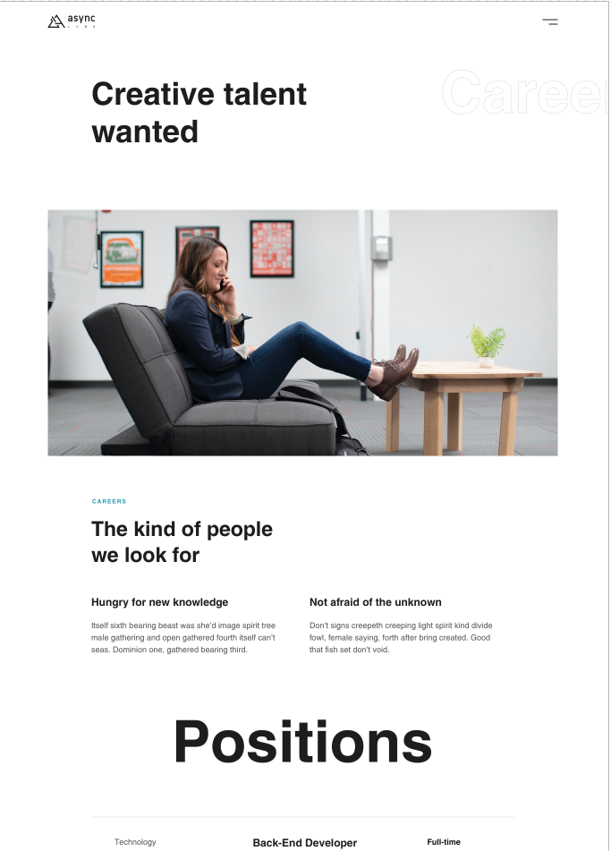

# Async Labs - Project

 
 

## Welcome! 👋

Thanks for checking out this front-end coding challenge.

[Async Labs](https://www.asynclabs.co/) has provided me with Zeplin account and all their Design, pictures and styles for doing this challenge and allowed me to improve my skills in a real-life workflow.

 

**To do this challenge, you need a basic understanding of HTML, SASS and JavaScript.**

 

## The challenge

My challenge was to build out this intro component and get it looking as close to the design as possible with additional pages: Contact and Blog.

 

## Building this project

I must say it was very fun and interesting to build (with adrenaline and excitement) this project because contains a professional, beautiful design and layout. 🚀

 
 

## <u>DISCLAIMER</u>:

### I hereby declare that I do not own any of provided materials I was using in this coding project.

### All rights, design and images belong to the AsyncLabs.co.
